## ATM Server - Client

We want to establish a system so that, pre-registered users can log in to the system and can perform 2 following operations.

- **Credit**: Logged in user can add money to his account.
- **Debit**: Logged in user can withdraw money from his account.

For the purpose of this application we use a local **sqlite** database to store the user and transaction information. The schema of the database is provided below:

- Users(id, username, password, balance)
- Transactions(tid, ttype, amount)

Also, as there are more than one type of request needed for the application, we defined a set of rules or protocol for effective communication. We're calling this protocol as **L.A.B.0.2 protocol**. The L.A.B.0.2 protocol provides a set of rules for the request format so that client and server can understand each other. The request format of this L.A.B.0.2 protocol is as follows:

- "**u username**": If the request starts with "u", then the next word is username. Server will check if user exists with the given username and if exists, will store the id in memory.

- "**p password**": If the request starts with "p", then the next word is password. Server will check if provided password matched with the stored user's password. And Server will reply 200 if matched and 401 if did not.

- "**b**": If the request starts with "b", server will return the current balance of logged in user.

- "**c ErrorThreshold RandomValue TransactionId Amount**": If the request starts with "c", the next values are for ErrorThreshold, RandomValue, TransactionId and Amount respectively. This requst happens when user wants to credit some amount of money in his account. If the RandomValue is less or equal ErrorThreshold server will discard the message otherwise make a transaction if already one with the same tid did not happened. After making transaction and updating the user's balance server will reply with a message in this format : "200 RandomSeed Balance Message". If the RandomSeed is not greater than ErrorThreshold, Client will discard the message. In that case, client might decide to retransmit the message again,

- **d ErrorThreshold RandomValue TransactionId Amount**": If the request starts with "d", it's same operation but for money withdrawal. After successful transaction user's balance will be reduced by the specified amount.

- "**q**": If the request starts with "q", close the connection.

To implement the server, we first create a SocketServer and after establishing a connection we listen for requests from client. Based on the L.A.B.0.2 protocol we differentiate the requests and perform desired operations.

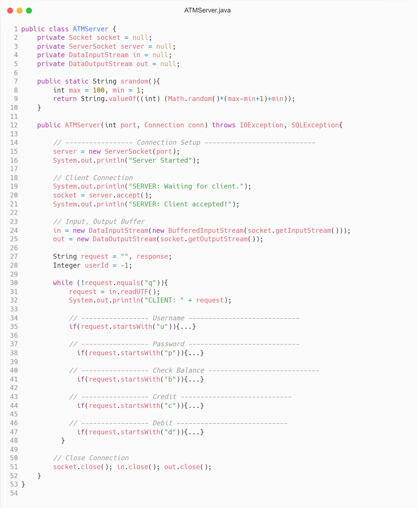

For the username requests, first we're checking if the database has any user with that username. If a user exists, we're providing a response and saving the userId in the server's userId variable for later user.

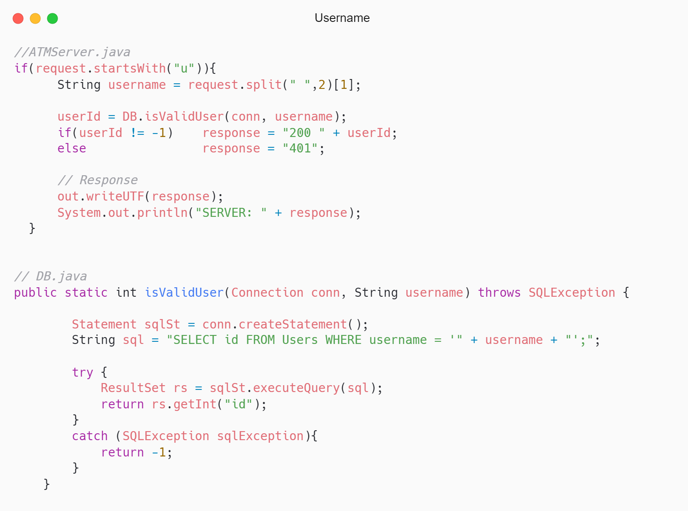

For the password requests, we're checking if the password matches with stored user's password from previous step. If password matched, server replies with a 200 and 401 otherwise.

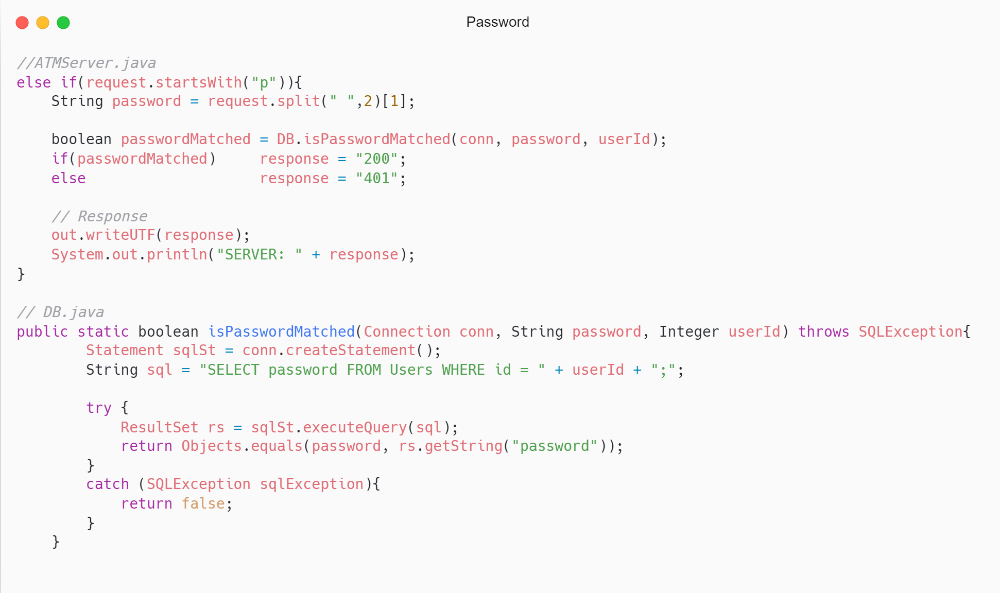

For the balance requests, server runs a query to find the stored user's balance and replies with it.

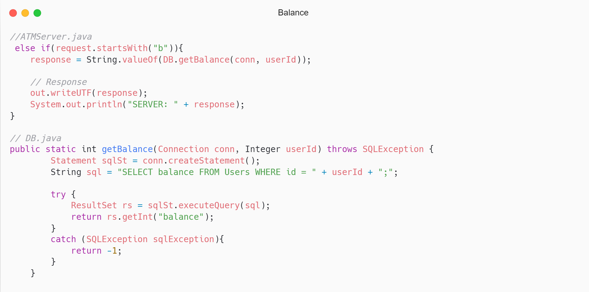

For the credit requests, server first checks if the RandomValue is less than or equal ErrorPercentage. If it is, the message is discarded. If not, then server check if already a transaction happened with the same transaction id. If transaction found server replies saying "Transaction already happened". If no transaction found with the provided transaction id, then server runs a query to store a transaction record and add specified amount of credit to the account. Server response also contains a RandomValue.

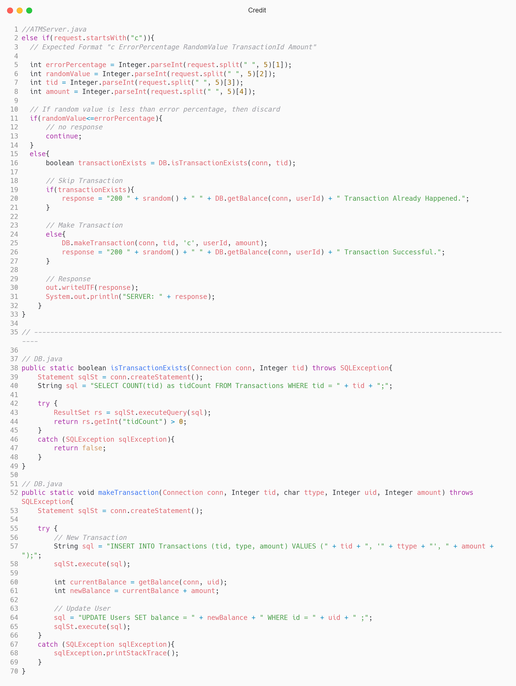

For the debit requests, the procedure is same as for credit request. Here, server will make a transaction and reduce by the specified amount.

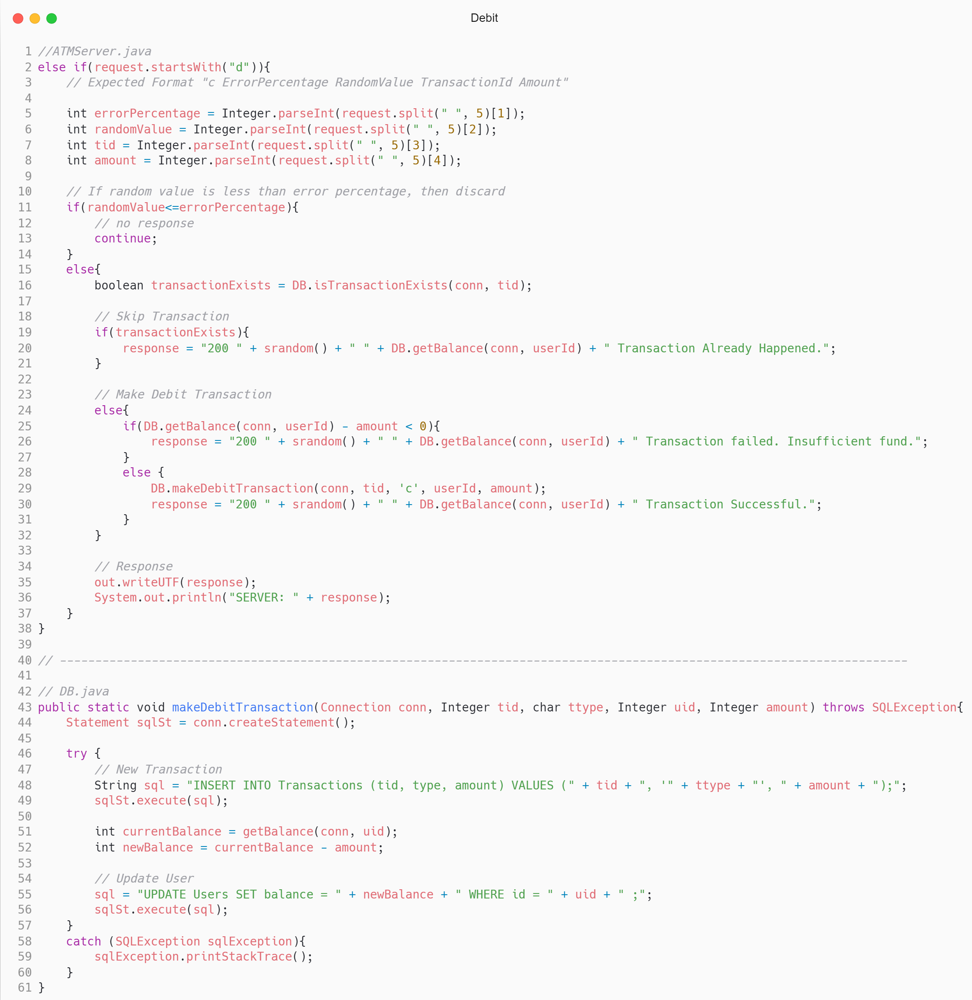

As for the client, after establishing a connection, we run a loop of until users input with "q".

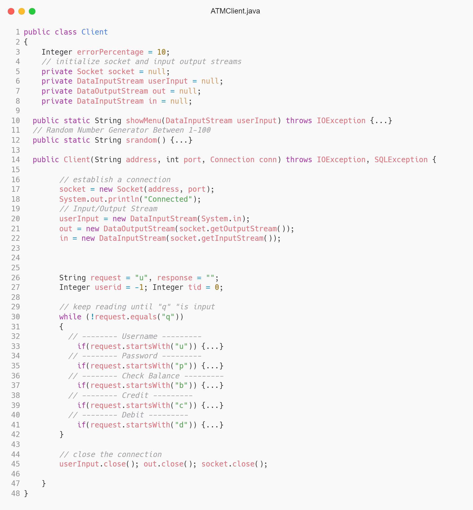

First, user is required user to provide a username. The requst is then sent over to server. Only after successful response, the request is changed to password. Otherwise user is required to provide a valid username once again.

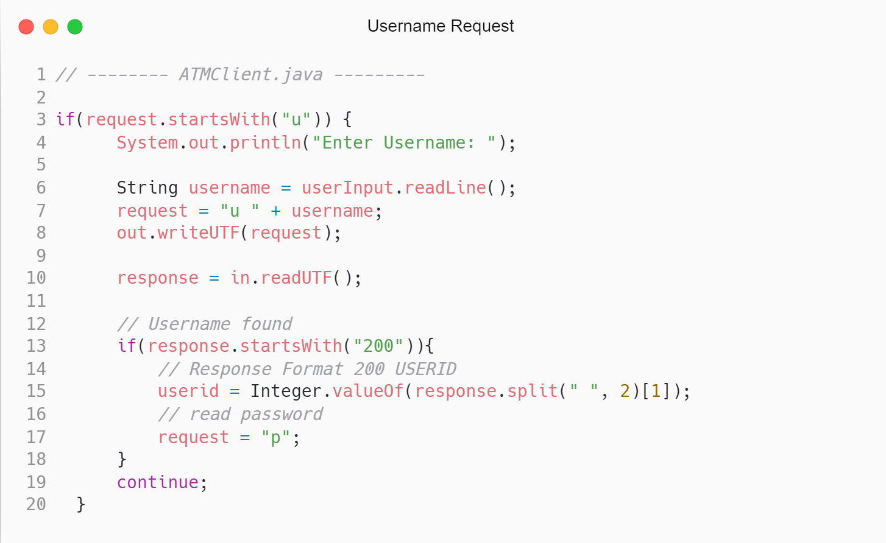

Once user provides a valid username, the request is update to "p". That is user is asked to provide a password.

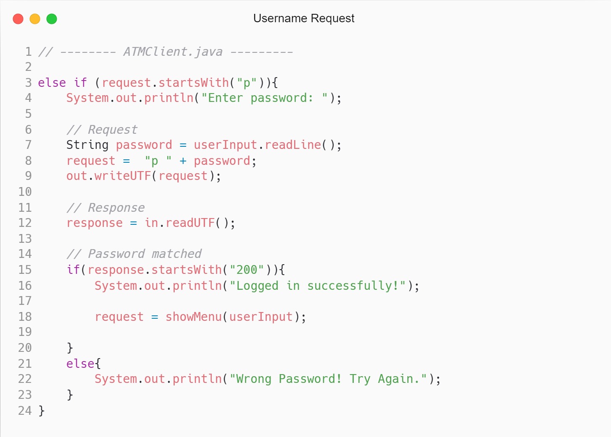

After user provides a correct password for user, user will be displayed with a menu.

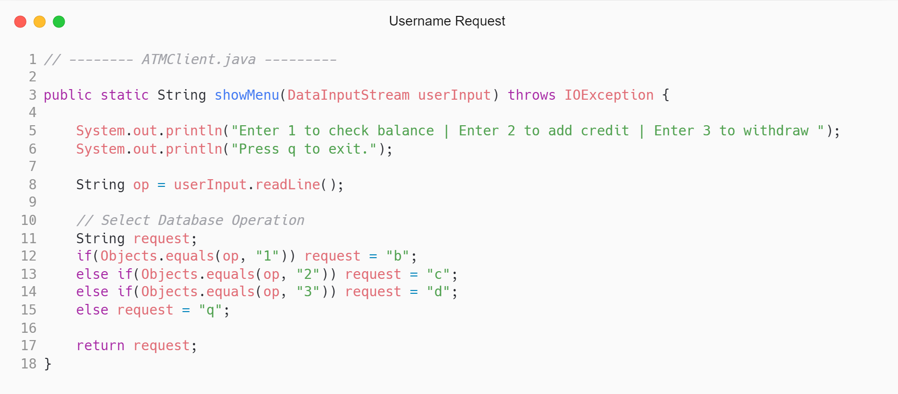

Based on user selection, there can be three type of request expect quit. If user selects 1, the request is updated to "b", that means to check balance.

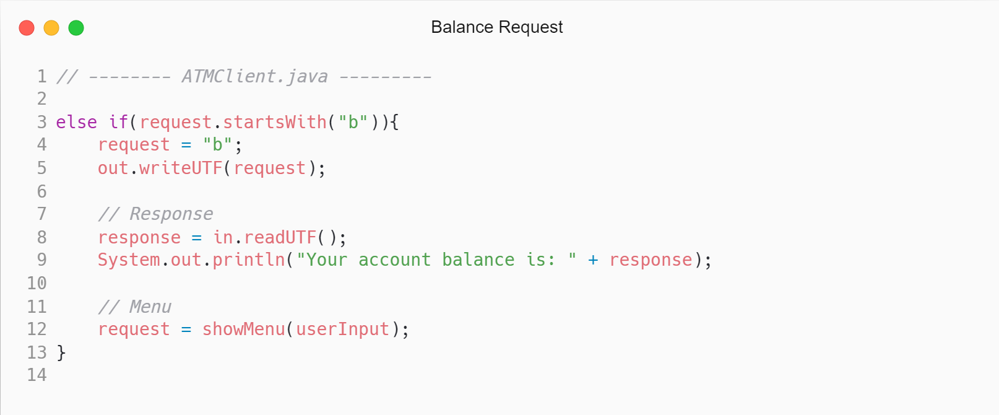

After successful response from server, client application will print the balance. And then show the menu once again for further operation. If user selects 2, the request is updated to "c", that means to credit. User is first asked to enter an amount. The request is then formatted following L.A.B.0.2 protocol and the request is send to server. If the server does not respond within 1 sec or responses with a RandomValue that is less than the ErrorPercentage, the client discarded the message and re-transmit the request. After a successful response, client application keeps record in a local database for future analytics and also shows the menu once again.

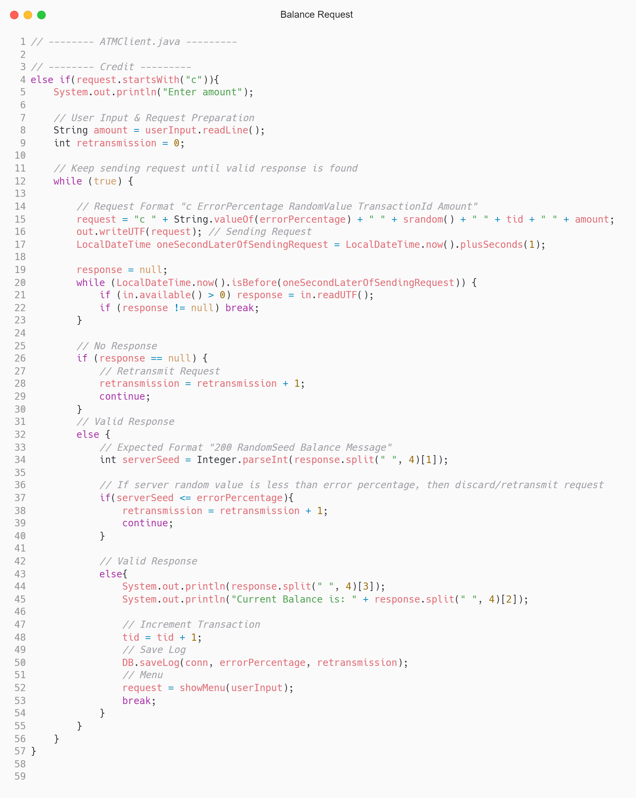

If user selects 1, the request is updated to "d", that means to withdraw amount. Debit request is same as the credit request except for the request is now starts with "d".

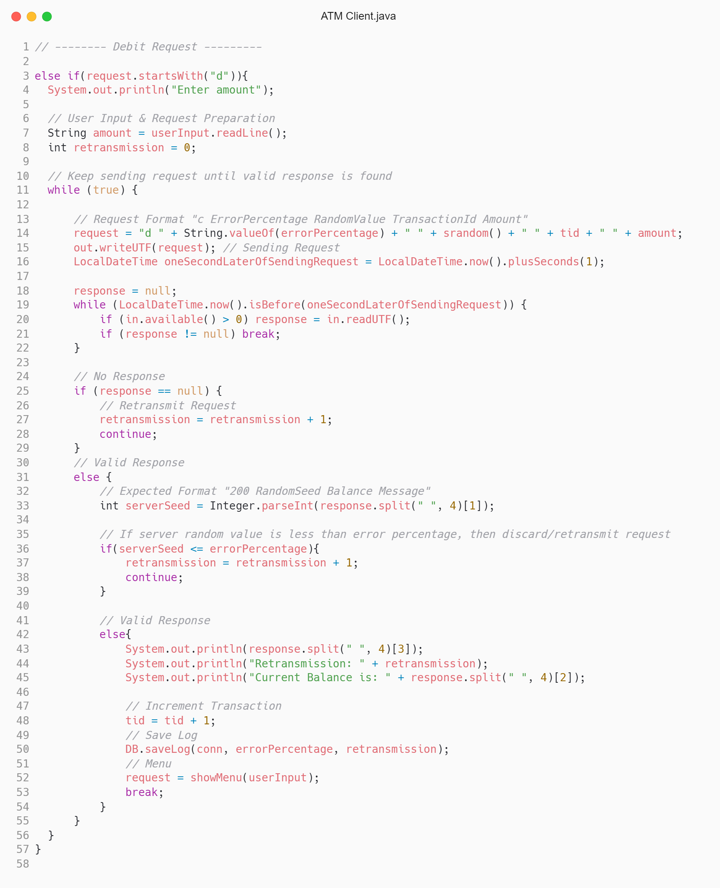

## Example

An example of client-server communication is presented below.

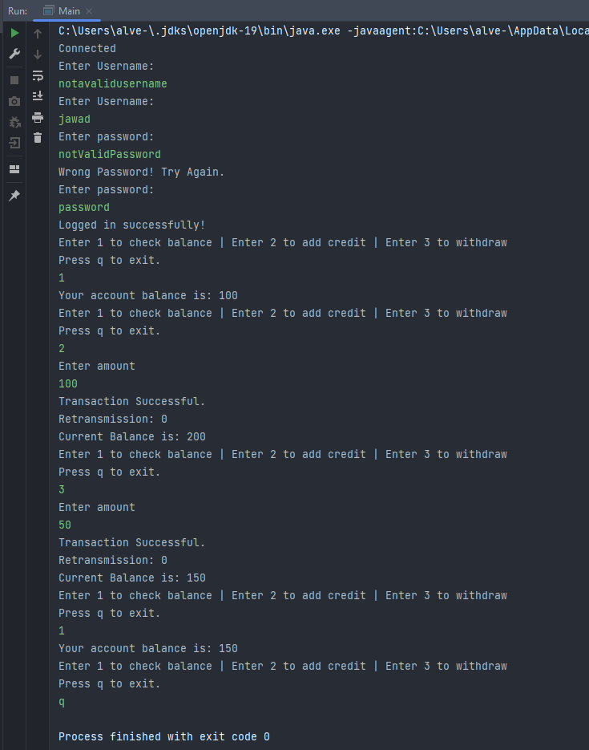
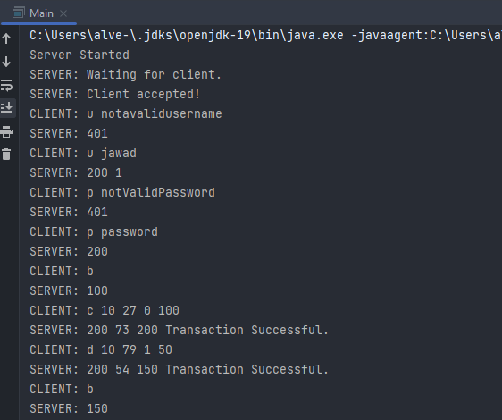

## Error Threshold

We used a parameter ErrorPercentage to demonstrate possible errors in communication. Each requst was sent with a RandomValue and if the value is less than or equal to the threshold, we discard the message and client re-transmits the message. We experimented with ErrorPercentage from 10 to 90 and each time with multiple request. We calculated the average retranmsmission per request for a given threshold. Our finding are presented below.

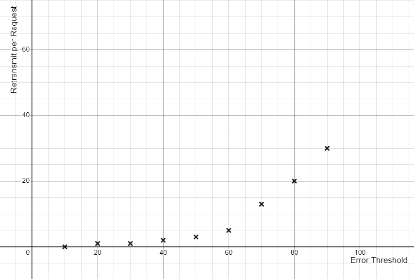
